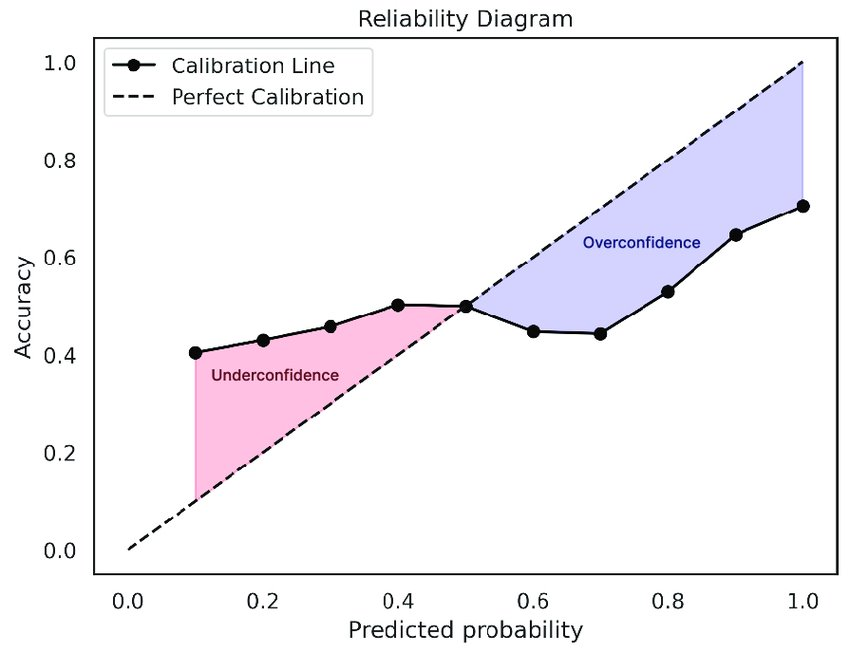
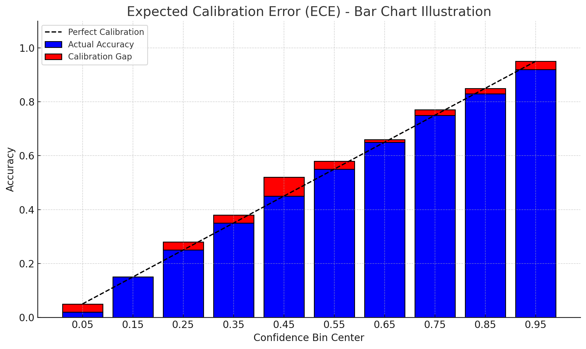
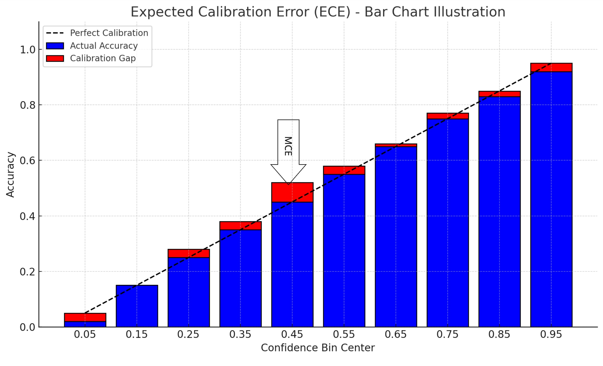

### Introduction
In the world of computer vision, and machine learning in general, confidence scores are an often misunderstood value. Many folks, both practitioners and project stakeholders in general, assume that a model's confidence score directly reflects the probability of correctness. However, this is only true if the model is well-calibrated. 

In real-world scenarios, particularly those of importance with high criticality, the likelihood of correctness is almost just as important as an accurate model prediction. Why? Because backend systems—whether it’s a database deciding what to store, or an API triggering an action—make binary decisions. Models give probabilities. Calibration is what lets a system draw a clean line between “trust this” and “maybe don’t". If your computer vision or ML system doesn’t report confidence, or reports uncalibrated scores, you’re either leaving performance on the table, or the system itself is unimportant. 

### Confidence Calibration: An Overview
**Confidence calibration** is a model’s ability to provide an accurate probability of correctness for a given prediction. For example, among predictions made with 90% confidence by a perfectly calibrated model, 90% will actually be correct.

Unfortunately, the architectures that dominate modern commercial computer vision use cases, such as deep convolutional networks and transformers, are typically **not well-calibrated**. Why this is the case is beyond the scope of this article, but one of the best resources on the topic is [*On Calibration of Modern Neural Networks*](https://arxiv.org/abs/1706.04599), which I highly recommend.

The key takeaway is simple: the most widely used models are not inherently calibrated, yet calibration is important. That makes calibration a problem worth solving.

### Measuring Confidence Calibration
#### Reliability Diagrams
The most LinkedIn-influencer-friendly way to measure a model’s confidence calibration is the **Reliability Diagram**. Predictions from the model are sorted into bins along the x-axis based on their confidence scores, and the accuracy of each bin is then calculated and plotted on the y-axis. A **perfectly calibrated** model will produce a reliability diagram that follows a 1:1 slope (a diagonal line from the origin to the top-right corner).

&nbsp;

    

&nbsp;

#### Expected Calibration Error (ECE)

ECE measures how well a model’s predicted confidence scores align with actual accuracy. It works by grouping predictions into bins based on confidence levels, then calculating the average difference between each bin’s confidence and observed accuracy. A lower ECE indicates better calibration.

&nbsp;

    

&nbsp;

Or, looking back at the reliability diagram above, ECE is the average vertical distance between each bin’s empirical accuracy and the perfect calibration line (an average of all the red bars). That’s why I like to think of ECE as the scalar version of what most people intuitively observe from a reliability diagram—a kind of general vibe-check summary statistic.

#### Maximum Calibration Error (MCE)

MCE captures the worst-case gap between predicted confidence and actual accuracy across all bins. Like ECE, it groups predictions into confidence bins, but instead of averaging, it reports the **maximum** observed gap—identifying the single most miscalibrated region of the model’s output.

&nbsp;

    

&nbsp;

Again, referring back to the reliability diagram, MCE is the height of the largest vertical gap between a bin’s accuracy and the perfect calibration line. I find MCE especially useful for high-risk systems and when choosing or evaluating calibration methods, as we’ll explore in Part 2 of this Confidence Calibration series.

#### Brier Score
The Brier Score quantifies the mean squared difference between predicted confidence and actual binary outcomes. A lower Brier Score indicates better-calibrated **and** more accurate predictions.

Unlike ECE or MCE, which focus purely on calibration, Brier Score blends both **calibration** and **discrimination**. This makes it a more holistic metric in some cases, but also harder to interpret in isolation. I like to think of it as the L2 loss of a model’s confidence output.

#### Conclusion
Now that we have some solid ways to understand how well our model is calibrated, in [Part 2](../on_calibration_part_2) we'll cover how to improve calibration with some post-hoc techniques.
