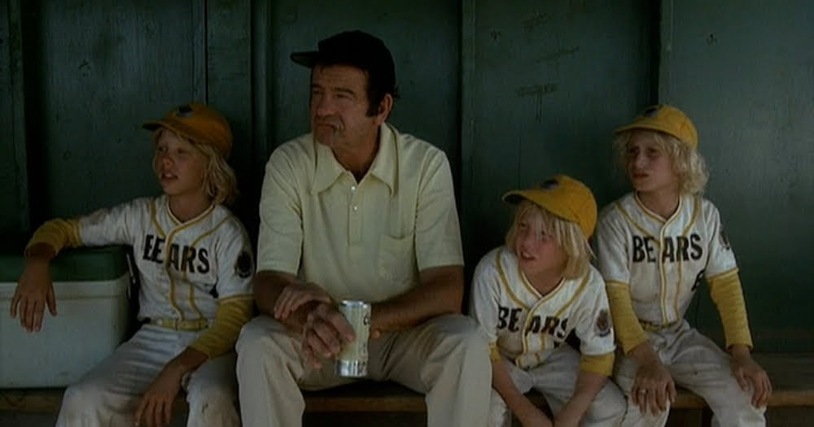

*October 2024*

### Introduction
Tools such as Roboflow, ultralytics, or Edge Impulse allow non-technical users to create computer vision models with high accuracy and performance. Never before has it been easier to develop computer vision models, and in the next few years, companies will slowly make each part of the computer vision development and deployment process just as pain-free. 

However, the best performance from these tools is usually produced by users who have at least a semi-academic understanding of the components and mechanisms that are responsible for the performance and accuracy of a system when deployed. This post will cover the key components found in modern convolutional neural networks, and metaphors that will hopefully enable a higher level of understanding for a semi-technical audience.

&nbsp;

### Convolutional Layers
Convolutions are like using a camera lens to highlight certain details in a scene. Imagine you have two things: the scene you're trying to capture (your input image) and the lens (the filter or kernel). When taking a picture, the lens focuses on specific parts of the scene to bring out important details like edges or textures (feature extraction). This is similar to how a convolutional layer works—it combines the input image with a filter to highlight certain patterns, like edges or shapes.

Just like the size of your camera lens and how you move it affects what you capture, convolutions are controlled by the kernel size (how big the lens is), stride (how far you move the lens between shots), and padding (whether you add a little extra space around the edges). In a convolutional neural network, this process helps the model "see" and extract important features from the image, one filter at a time, which combines into an understanding of the whole scene.

&nbsp;

    

&nbsp;

Kernel size, stride, and padding are the three parameters that one should pay attention to when attempting to make an off-the-shelf architecture such as YOLOv8 work for their use case. 

General Trade-offs:
- For **small objects**, precision is prioritized by using:
  - Small kernels
  - Small strides
  - Padding to preserve details

- For **large objects**, efficiency is favored by using:
  - Larger kernels
  - Larger strides
  - Sometimes less padding to reduce computation while still capturing relevant patterns

&nbsp;

### Loss Functions
It's freshman year of high school and as the shortest kid in your grade sports like football are not exactly a short path to success. So you turn to archery. As you practice, your coach is watching and giving you feedback based on where your arrow lands. If your arrow hits far from the bullseye, the coach tells you how much you need to adjust your aim. The farther your shot is from the bullseye, the more adjustments the coach suggests.

In the same way, a loss function in a neural network measures how far the model’s predictions (the arrows) are from the correct target (the bullseye). The loss function calculates the "distance" from the perfect prediction and tells the model how to adjust its parameters. Just like with archery practice, where you improve your aim with each shot (epoch) based on the feedback, the model uses the feedback from the loss function to fine-tune its parameters, so that over time, its predictions (arrows) land closer to the target (correct output).

&nbsp;

### Non-Maximum Supression (NMS)
It's 2010, and while on vacation you ask a stranger to use your iPhone 4 to snap some pictures of you in front of Butte Montana's amazing Berkely Pit (our proudest landmark). Upon review, you find the stranger took dozens of very similar images and so many images are a real risk to your iPhone's state-of-the-art 32 GB memory. Rather than keeping all of the images, you select the ones you like the most. 

In the same way, Non-Maximum Suppression (NMS) helps a model handle multiple overlapping detections of the same object. When the model detects an object, it often predicts several bounding boxes around it, each slightly different but overlapping. NMS selects the most confident prediction (the “best photo”) and removes the others that are less confident but similar (overlapping boxes). This ensures that the model outputs only one bounding box per object, making the detection cleaner and more efficient. NMS is also used in keypoint detection, NLP, and segmentation tasks.

IoU Threshold, Confidence Threshold, and Maximum Detections are the three parameters that one should pay attention to when attempting to make an off-the-shelf architecture such as YOLOv8 work for their use case.

&nbsp;

    

&nbsp;

General Trade-Offs:

#### 1. **IoU Threshold**
- **Controls**: How much overlap between boxes is allowed before suppressing.
- **High IoU (e.g., 0.7)**: Keeps more overlapping boxes (higher recall, lower precision).
- **Low IoU (e.g., 0.3)**: Suppresses more boxes (higher precision, lower recall).

#### 2. **Confidence Threshold**
- **Controls**: Minimum confidence score for keeping a box.
- **High Threshold (e.g., 0.8)**: Keeps only high-confidence boxes (fewer false positives, lower recall).
- **Low Threshold (e.g., 0.3)**: Keeps more boxes (higher recall, but more false positives).

#### 3. **Max Detections**
- **Controls**: Maximum number of boxes NMS retains.
- **High Max**: Keeps more boxes (better for crowded scenes, but can cause clutter).
- **Low Max**: Keeps fewer boxes (reduces noise, but might miss objects in dense scenes).

&nbsp;

### Activation Functions
Imagine a room with a dimmer switch that controls the brightness of the lights (signals). The room can be completely dark (zero output), fully bright (strong signal), or somewhere in between. Just like how certain objects in a room only become visible when the light reaches a specific brightness, features in a neural network are only passed to the next layer if their signal strength, as determined by the activation function, is strong enough.

In the same way that dim lighting might obscure smaller or more subtle objects, weak signals might not get emphasized enough to make it through the network. The activation function controls this process, letting only the most important or relevant signals (features) move forward while dimming or ignoring others that don’t meet the threshold. So, depending on the "intensity" of the signal, certain features are highlighted and passed on, while others are suppressed, helping the model focus on what’s important.

&nbsp;

### Pooling Layers
You're running late for the airport and diligently watching your Uber driver's location on the app's map as they finish a ride before heading to pick you up. Zooming out lets you see the overall layout of a city or region, but you lose the fine details, like individual street names or the fact the driver is headed in your direction. However, zooming out helps you focus on the bigger, more important features—like the main roads, regions, or the fact your driver is still on the other side of the city.

Pooling layers in a neural network work similarly. They "zoom-out" on the feature map, reducing the resolution but keeping the important patterns & features intact. Just like with the map, you sacrifice some of the finer details, but this helps the network focus on the larger, more critical information that helps with understanding the overall structure of the input.

&nbsp;

### Fully Connected Layers (Dense Layers)
You've just sat down for what will become a 4-hour meeting even though it was only scheduled for 2. The objective of the meeting is to lay out your company's plans for next quarter. Each person at the table represents a division of your company. Some members have details about the budget, others know about timelines, and a few represent expertise in customer preferences. When it’s time to make a decision, everyone on the committee shares their input, and together, you conclude by considering all the information.

In a neural network, fully connected layers act similarly. After the earlier layers (like convolutional layers) extract different features from the input, the fully connected layer brings all those features together. Every neuron in this layer is "connected" to every neuron in the previous layer, just like every committee member has a say. The network then weighs each piece of information (or feature) to make the final decision, whether it’s classifying an image or making a prediction.

&nbsp;

### Batch Normalization
While prepping for a tailgate, you're putting beers and ice in a cooler. Your buddy didn't spread out the ice in the cooler, and now only those beers that are directly near the ice are cold. So you pick up the cooler and give the dang thing a shake to spread the ice evenly so all your beers are equally as crisp and cold. That shake was batch normalization. In a neural network, data can become "uneven" or inconsistent as it moves through the layers—some neurons might produce overly large or small values, just like some beers get colder faster. Batch normalization “shakes things up” by adjusting the inputs, ensuring that all neurons work on data that is normalized to a consistent range. This helps the model learn more efficiently and evenly, preventing one part of the network from overfitting while others underperform.

If you're wondering what causes data to become "uneven", there are two main causes: internal covariate shift, and exploding/vanishing gradients. Just like you do not attempt to understand why your buddy sucks at putting ice in a cooler because you know shaking the cooler fixes things, I recommend knowing that batch normalization works and suggest looking up internal covariate shift, and exploding/vanishing gradients once you've ran out of anything else to do.

&nbsp;

### Dropout
You're a baseball coach, and your team has an awful drinking problem. Quite often, players don't show up for games, and so those who are present need to pick up the slack. In a moment of genius, you realize you need to practice for situations where players are out sick with the beer flu. During practice, you randomly tell some of your players to sit out for certain drills. This forces the remaining players to step up and cover more ground, improving their ability to play more flexibly when they can't rely on the same key players every time. When game day comes, the entire team is stronger because everyone has had to improve and adapt.

In a neural network, dropout works similarly. During training, dropout randomly "turns off" (or drops out) some neurons in each layer for each pass through the data. This forces the remaining neurons to carry more responsibility, ensuring that the network doesn’t become too reliant on any one part of itself. As a result, when all neurons are active during testing, the network performs better because every neuron has learned to contribute, making it more robust and less prone to overfitting.

&nbsp;

    

&nbsp;

### I will continue to add more metaphorical descriptions as I think of them, please reach out if you have any to share. 