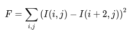
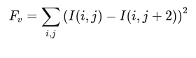
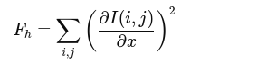
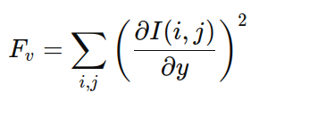
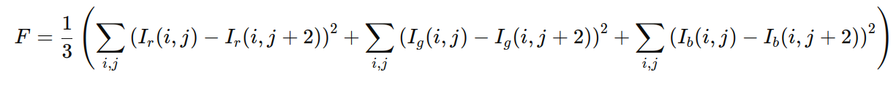
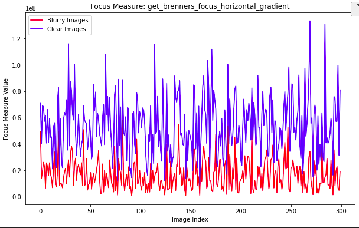

# In Progress

*September 2024*

Click here to the demo available in Google Colab

[](https://colab.research.google.com/github/bowentkruse/quantifyingFocus/blob/master/demo.ipynb)
<p>&nbsp;</p>

### Introduction
Knowing the degree of sharpness or focus in an image is incredibly important when building computer vision systems. In real-world scenarios, cameras often face challenges like vibrations, motion blur, dirty lenses, or improper focus, which result in images that are far from perfectly clear. Any blurring or imperfection in an image can have a major impact on the accuracy of a computer vision model. This is a well-studied issue, whether it affects the training phase of developing a reliable convolutional neural network or when the system is deployed in real-world environments.

### Focus Measure Algorithms: An Overview
Quantifying image clarity is critical, and lucky for us, numerous methods have been developed to address this. These techniques range from algorithms that analyze an entire image to those that focus on specific regions or even individual pixels, depending on the use case. The Cheriton School of Computer Science at the University of Waterloo, Canada, has published [this excellent paper](https://cs.uwaterloo.ca/~vanbeek/Publications/spie2014.pdf) that compares various focus measures in a clear and accessible way. Rather than summarizing their findings, I’ll take the easy route and recommend reading the paper directly. Then, follow along with my example implementation of the focus measure I've found most effective in real-world applications: Brenner's Focus Measure.

### Evaluating Brenner's Focus Measure Variations
Click here to open in Colab

[](https://colab.research.google.com/github/bowentkruse/quantifyingFocus/blob/master/demo.ipynb)
<p>&nbsp;</p>

In this demo, we'll implement multiple variations of Brenner's focus measure and then analyze which method is most effective on the [GoPro dataset](https://paperswithcode.com/dataset/gopro). The full dataset can be found [here](https://seungjunnah.github.io/Datasets/gopro.html). We'll pretend in this scenario that these are images captured by a deployed camera, and our goal is to automatically filter out blurry images. 
<p>&nbsp;</p>

#### Variation 1: Horizontal Derivative (The Original)
The first variation we'll implement is the original, which sums the squares of the horizontal first derivative. This is a complicated way to say it measures the difference in brightness between neighboring pixels in the horizontal direction. 

<p>&nbsp;</p>
<div style="text-align: center; margin-bottom: 20px;">
    
</div>

<p>&nbsp;</p>

```
def get_brenners_focus_horizontal_derivative(pil_image: Image.Image) -> float:
    """
    Calculate Brenner's focus measure to assess the sharpness of a given image.
    Variation 1 of Brenner's focus measure

    Args:
        pil_image (Image.Image): A PIL Image object to be analyzed.

    Returns:
        float: Brenner's focus measure for the image.
    """
    
    # Ensure the input image is in grayscale mode ('L' mode)
    if pil_image.mode != 'L':
        pil_image = pil_image.convert('L')

    # Convert the PIL image to a NumPy array for efficient processing
    image = np.array(pil_image)

    # Compute the difference between adjacent pixels along the horizontal axis (axis=1)
    diff = np.diff(image, axis=1)

    # Calculate Brenner's focus measure by summing the squares of the differences
    focus_measure = np.sum(diff**2)

    return focus_measure
```
<p>&nbsp;</p>

#### Version 2: Vertical Derivative
The second variation is very similar to the original, however instead of measuring the difference between pixels in the horizontal direction, the derivative is taken in the vertical direction. 
<p>&nbsp;</p>
<div style="text-align: center; margin-bottom: 20px;">
    
</div>

<p>&nbsp;</p>

```
def get_brenners_focus_vert_derivative(pil_image: Image.Image) -> float:
    """
    Calculate Brenner's focus measure to assess the sharpness of a given image.
    Variation 2 of Brenner's focus measure
    Args:
        pil_image (Image.Image): A PIL Image object to be analyzed.

    Returns:
        float: Brenner's focus measure for the image.
    """
    
    # Ensure the input image is in grayscale mode ('L' mode)
    if pil_image.mode != 'L':
        pil_image = pil_image.convert('L')

    # Convert the PIL image to a NumPy array for efficient processing
    image = np.array(pil_image)

    # Compute the difference between adjacent pixels along the vertical axis (axis=0)
    diff = np.diff(image, axis=0)

    # Calculate Brenner's focus measure by summing the squares of the differences
    focus_measure = np.sum(diff**2)

    return focus_measure
```
<p>&nbsp;</p>

#### Variation 3: Horizontal Gradient
For the third variation, instead of simply taking difference between adjacent pixels, this variation uses the gradient (rate of change) along the horizontal direction, rather than just the pixel-to-pixel differences as in the original Brenner's measure. This method is more sophisticated and robust than the original Brenner focus measure because it can better handle subtle changes in intensity and is less sensitive to noise.

<p>&nbsp;</p>
<div style="text-align: center; margin-bottom: 20px;">
    
</div>

<p>&nbsp;</p>

```
def get_brenners_focus_horizontal_gradient(pil_image: Image.Image) -> float:
    """
    Calculate Brenner's focus measure to assess the sharpness of a given image.
    Variation 3 of Brenner's focus measure

    Args:
        pil_image (Image.Image): A PIL Image object to be analyzed.

    Returns:
        float: Brenner's focus measure for the image.
    """
    
    # Ensure the input image is in grayscale mode ('L' mode)
    if pil_image.mode != 'L':
        pil_image = pil_image.convert('L')

    # Convert the PIL image to a NumPy array for efficient processing
    image = np.array(pil_image)

    # Gradient in the horizontal direction
    grad_x = np.gradient(image, axis=1)  

    # Sum of squares of horizontal gradient
    focus_measure = np.sum(grad_x**2)

    return focus_measure
```
<p>&nbsp;</p>

#### Variation 4: Vertical Gradient
The forth variant we'll implement is similar to the third variation, however it will instead use the vertical gradient.


<p>&nbsp;</p>
<div style="text-align: center; margin-bottom: 20px;">
    
</div>

<p>&nbsp;</p>

```
def get_brenners_focus_vert_gradient(pil_image: Image.Image) -> float:
    """
    Calculate Brenner's focus measure to assess the sharpness of a given image.
    Variation 4 of Brenner's focus measure

    Args:
        pil_image (Image.Image): A PIL Image object to be analyzed.

    Returns:
        float: Brenner's focus measure for the image.
    """
    
    # Ensure the input image is in grayscale mode ('L' mode)
    if pil_image.mode != 'L':
        pil_image = pil_image.convert('L')

    # Convert the PIL image to a NumPy array for efficient processing
    image = np.array(pil_image)

    # Gradient in the vertical direction
    grad_x = np.gradient(image, axis=0)  

    # Sum of squares of vertical gradient
    focus_measure = np.sum(grad_x**2)

    return focus_measure
```
<p>&nbsp;</p>

#### Variation 5: Horizontal Derivative (With Color)
This is a variation on the first original equation that computes the horizontal derivative for each color channel (Red, Green, and Blue), and then it averages the focus measures across the three channels. Note that some great next steps would be to call one of the other 3 varations we've tested here today instead of the original horizontal derivative variation and evaluate the results. 

<p>&nbsp;</p>
<div style="text-align: center; margin-bottom: 20px;">
    
</div>

<p>&nbsp;</p>

```

def get_brenners_focus_color(pil_image: Image.Image) -> float:
    """
    Calculate Brenner's focus measure for a color image by applying the horizontal derivative
    Brenner's focus measure to each color channel (R, G, B) and then averaging the focus measure values.

    Args:
        pil_image (Image.Image): A PIL Image object to be analyzed.

    Returns:
        float: Brenner's focus measure for the color image.
    """
    
    # Convert the PIL image to a NumPy array
    image = np.array(pil_image)
    
    # Split the image into its R, G, B channels
    if image.ndim == 3:  # Check if it's a color image
        red_channel = image[:, :, 0]
        green_channel = image[:, :, 1]
        blue_channel = image[:, :, 2]
    else:
        raise ValueError("Input image must be a color image with 3 channels.")
    
    # Convert the NumPy arrays for each channel back to PIL images so that it's compatible with our previous implementations of brenner's focus measure. 
    red_pil = Image.fromarray(red_channel)
    green_pil = Image.fromarray(green_channel)
    blue_pil = Image.fromarray(blue_channel)

    # Apply the Brenner's focus measure to each channel using get_brenners_focus_horizontal_derivative
    red_focus = get_brenners_focus_horizontal_derivative(red_pil)
    green_focus = get_brenners_focus_horizontal_derivative(green_pil)
    blue_focus = get_brenners_focus_horizontal_derivative(blue_pil)

    # Aggregate the focus measures by averaging them across the channels
    focus_measure = (red_focus + green_focus + blue_focus) / 3

    return focus_measure

```
### Evaluating Focus for the GoPro Dataset
In order to evaluate each focus measure varation's ability to distinguish between blurry and clear images, lets assume that the larger absolute difference (separation) between the clear set's mean focus measure and the blurry set's mean focus measure the better. 

In order to do this, for each brenner's focus measure variation we implemented, we will calculate the mean focus measure for both the clear set of images, and the blury set of images. Then, we'll find the difference between each set's focus measure mean. We'll also plot the focus measure for each image so we can visually verify the results. 

If you're not following along in the colab note book, this evaluation code can be found in [demo.ipynb](https://github.com/bowentkruse/quantifyingFocus/blob/master/demo.ipynb).

### Results

**Variation 1: Horizontal Derivative (The Original)**
- Blurry Images - Mean: 10532908.25
- Clear Images - Mean: 18553935.046666667
- Separation: 8021026.796666667

**Version 2: Vertical Derivative**
- Blurry Images - Mean: 12077206.03
- Clear Images - Mean: 20029785.356666666
- Separation: 7952579.326666666

**Variation 3: Horizontal Gradient**
- Blurry Images - Mean: 16788168.4025
- Clear Images - Mean: 54070488.63333333
- Separation: 37282320.23083334

**Variation 4: Vertical Gradient**
- Blurry Images - Mean: 21482787.395833332
- Clear Images - Mean: 55197934.09
- Separation: 33715146.694166675

**Variation 5: Horizontal Derivative (With Color)**
- Blurry Images - Mean: 10792328.3
- Clear Images - Mean: 18960645.175555553
- Separation: 8168316.875555553

<p>&nbsp;</p>

Looking at our results, Variation 3: Horizontal Gradient produced the largest absolute difference (separation) between the clear set's mean focus measure and the blurry set's mean focus measure the better. This can also be visually verified in the visual produced by our evaluation function. 

<p>&nbsp;</p>
<div style="text-align: center; margin-bottom: 20px;">
    
</div>

<p>&nbsp;</p>

### Further Reading and Resources
[An extensive empirical evaluation of focus measures
for digital photography](https://cs.uwaterloo.ca/~vanbeek/Publications/spie2014.pdf)

[Focus Measure Operators](https://sites.google.com/view/cvia/focus-measure)