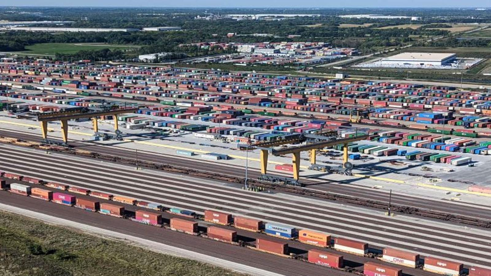

# The Problem
---
Imagine arriving flying into an airport. This airport has 8000 parking spaces. You’re in a massive hurry and in this large airport parking lot, you must find your vehicle and do so quickly. However, your sister's cousin’s roommate’s chiropractor’s best friend was the one who parked your vehicle. Although you agreed upon a certain parking space so that you could locate your car, it was parked in the spot most convenient for your sister's cousin’s roommate’s chiropractor’s best friend. This alternative location was not reported to you. Now imagine you must find your vehicle hundreds of times per day, every day.

This is the reality for many railroads. Intermodal containers and trailers destined to be loaded onto trains are dropped off by customers in intermodal yards in parking spots most convenient for the driver. When it comes time to load containers onto a train, finding each of these containers one by one is infeasible. As a result, human employees periodically drive around the entire yard manually recording the unique identifier of each container or trailer in each of the thousands of spots in the intermodal yard. While mostly effective, utilizing humans to survey a yard’s inventory is expensive, slow, and only as consistent as humans are.

&nbsp;

    

&nbsp;

# The Solution: Automated Inventory Survey
---
Roving around these intermodal yards 24/7 is a vehicle called a hostler. The industrial vehicle equivalent of [Gimli](https://lotr.fandom.com/wiki/Gimli) in appearance, these vehicles pull containers/trailers next to the tracks to be loaded onto trains or pull containers recently unloaded off trains from the trackside to a standard parking spot.

&nbsp;

    

&nbsp;

Because these vehicles already pass by all the physical information required, a teammate and I saw this as an opportunity and spent the next two months building. We built a prototype that was then suction-cupped onto the roof of my personal vehicle using parts we scraped together from our own personal stashes of gadgets and goodies. We developed basic models that we deployed to NVIDIA Jetsons, and then built a custom localization algorithm that used the latitude and longitude at which the image was captured to estimate the location of each container/trailer seen. Two models were developed for this scene text detection use case, one to locate each container and its identifier, and one to recognize the text value of the identifier, a use case very similar to ALPR. 

Taking the term “intrapreneur” a bit too seriously, we ran this project like a startup. We created a pitch deck and prototype, which were presented to acquire internal funding, created branding for the project, got customer buy-in, hired a team of talented developers, and sweated through 80-hour work weeks until somehow our solution was adopted and deployed around the country at various intermodal yards. This has enabled massive cost savings and allowed our intermodal yard managers to operate with the highest level of precision ever.

&nbsp;

## After Action Report
---
Throughout this process, I took notes on lessons that have now joined the many tenets by which I approach all new problems.

### Build Platforms, Not Projects

While constructing the cloud-based infrastructure that would ingest detections made by our vehicle-mounted perception systems, we realized that it was a real pain in the ass—something we’d only like to do once. So we built an agnostic platform that would integrate with any current or future projects. This platform enabled not only the ingestion of detections and the application of business logic but also IoT operations, such as updating edge software and health monitoring. The lesson learned is that the effort of building a single platform makes building any future project faster and cheaper.

### Shared Ownership

Similar to the philosophy that justifies the existence of customer success engineers, a great solution not only works well and scales well but, most importantly, is used well. While constructing this project, we went so far as to get certified to operate the hostlers so that our understanding of what success looked like was as holistic as it could be. Metrics such as mean average precision, frames per second, latency, or system accuracy all come second to the metrics that define success for the customer.

### Staying Informed is a KPI

Throughout this project, we threw multiple Hail Marys. The reason they were successful was that our team took knowing the possibilities of the latest and greatest technologies as a non-negotiable responsibility. Our team was working full throttle, putting in countless hours, but still made time to know what had recently become possible. As a result, when the time came to provide a solution to what seemed like an impossible issue, our toolbox for solving problems rose to the occasion.

&nbsp;

## Technical Highlights
---
There were also some technical achievements that I am particularly proud of:

### Using Historical Context to Improve New Detections

An implementation of my [Context & Perception with Computer Vision](../../articles/context_in_percepetion) approach, I built software so that each edge perception system remembered what it had seen before. This knowledge of historical inventory was spatially aware, allowing for location corrections and the improvement of new detections.

### Use Case Specific Pool-Based Sampling Active Learning

[Active learning](https://blog.roboflow.com/what-is-active-learning/#pool-based-sampling) is the process of identifying what is missing from your training dataset. Pool-Based sampling is ranking examples and selecting the top n number of samples to add to the training set. Or, if you’re a math-head, identifying out-of-distribution data and prioritizing which to add to the dataset. I built an algorithm that instead of just prioritizing images by incorrect detections or low confidences, prioritized samples based on a spatial and time-based heuristic so that improvement in the model meant an improvement as measured by our customers success metrics.

### Node-Based Model Deployment

Deploying models to both edge computers or the cloud is hard. So we built a platform where each piece of functionality involved with inference—such as pre-processing, post-processing, publishing, sensor fusion—was represented as a node. This way, each functionality could be combined into a single pipeline that is then deployed as one entity. This, of course, was built using some amazing technology stacks such as NVIDIA Triton Inference Server, Redis, and Roboflow.

---

&nbsp;

**Patent Status:** *All solutions mentioned are either patented or have a patent pending.*