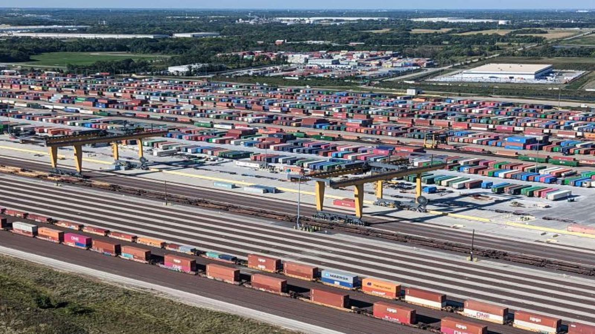

This is the same problem as mentioned in [Intermodal Yard Automated Inventory Survey](project1.md) just with a different, though similar, approach. Together the two solutions provided an ecosystem that were built to work together. 

&nbsp;

# The Problem
---
Imagine arriving flying into an airport. This airport has 8000 parking spaces. You’re in a massive hurry and in this large airport parking lot, you must find your vehicle and do so quickly. However, your sister's cousin’s roommate’s chiropractor’s best friend was the one who parked your vehicle. Although you agreed upon a certain parking space so that you could locate your car, it was parked in the spot most convenient for your sister's cousin’s roommate’s chiropractor’s best friend. This alternative location was not reported to you. Now imagine you must find your vehicle hundreds of times per day, every day.

This is the reality for many railroads. Intermodal containers and trailers destined to be loaded onto trains are dropped off by customers in intermodal yards in parking spots most convenient for the driver. When it comes time to load containers onto a train, finding each of these containers one by one is infeasible. As a result, human employees periodically drive around the entire yard manually recording the unique identifier of each container or trailer in each of the thousands of spots in the intermodal yard. While mostly effective, utilizing humans to survey a yard’s inventory is expensive, slow, and only as consistent as humans are.

&nbsp;

    

&nbsp;

# The Solution: Automated Inventory Survey
---

When I joined BNSF, our amazing UAS team already had 90% of this amazing project done. I just gave it an extra accuracy and performance bump to get it over the production finish line.
 Drones that live in docks would take off and fly preprogrammed flight paths as a human operators supervise. Then use computer vision to 1. Read the unique identifiers of each container/trailer and 2. Calculate the lot, row and spot number of each surveyed unit. Two models were developed for this scene text detection use case, one to locate each container and its identifier, and one to recognize the text value of the identifier, a use case very similar to ALPR. 

 BNSF despite being an ancient business has always been a leader in the UAS space. My role in this project was more limited to the classical definition of a computer vision engineer. 

I brought the drone data labeling process over to roboflow, redesigned annotation standards and implemented newer state of the art neural network architectures. I collaborated with the drone developers so that flight paths were optimized to produce images that played well with our inference pipeline. I managed a team of annotators to produce quality datasets for 8 different models (for the various flight conditions). I implemented Ray Tuning to improve the hyperparameter tuning process. I created simulated deployment test suites for testing upgrades/changes.

---

&nbsp;

**Patent Status:** *All solutions mentioned are either patented or have a patent pending.*